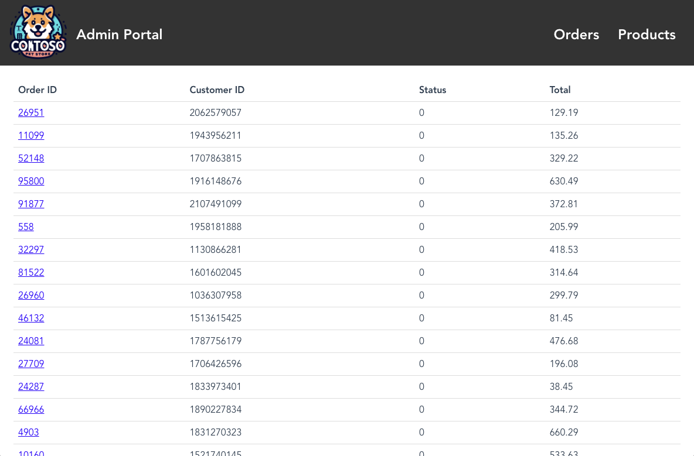
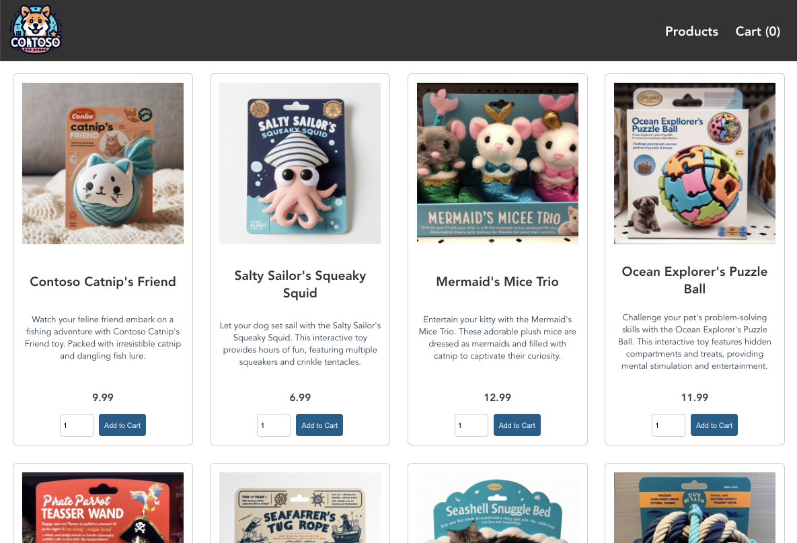

Module 2 - Let's build the application
==============

This application is taken from the [AKS Store Demo](https://github.com/Azure-Samples/aks-store-demo) and is a sample demo app consisting of a group of containerized microservices that can be easily deployed into a Kubernetes cluster.
This is meant to show a realistic scenario using a polyglot architecture, event-driven design, and common open source back-end services (eg - RabbitMQ, MongoDB).
The application also leverages OpenAI's GPT-3 models to generate product descriptions.
This workshop will use [OpenAI](https://openai.com/) to generate product descriptions, but you can use [Azure OpenAI](https://learn.microsoft.com/azure/ai-services/openai/overview).

This application is inspired by another demo app called [Red Dog](https://github.com/Azure/reddog-code).

# AKS Store Demo

This sample demo app consists of a group of containerized microservices that can be easily deployed into an Azure Kubernetes Service (AKS) cluster. This is meant to show a realistic scenario using a polyglot architecture, event-driven design, and common open source back-end services (eg - RabbitMQ, MongoDB). The application also leverages OpenAI's GPT-3 models to generate product descriptions. This can be done using either [Azure OpenAI](https://learn.microsoft.com/azure/ai-services/openai/overview) or [OpenAI](https://openai.com/).

This application is inspired by another demo app called [Red Dog](https://github.com/Azure/reddog-code).

> [!NOTE]
> This is not meant to be an example of perfect code to be used in production, but more about showing a realistic application running in Kubernetes. 


## Architecture

The application has the following services: 

| Service | Description |
| --- | --- |
| `makeline-service` | This service handles processing orders from the queue and completing them (Golang) |
| `order-service` | This service is used for placing orders (Javascript) |
| `product-service` | This service is used to perform CRUD operations on products (Rust) |
| `store-front` | Web app for customers to place orders (Vue.js) |
| `store-admin` | Web app used by store employees to view orders in queue and manage products (Vue.js) | 
| `virtual-customer` | Simulates order creation on a scheduled basis (Rust) |
| `virtual-worker` | Simulates order completion on a scheduled basis (Rust) |
| `ai-service` | Optional service for adding generative text and graphics creation (Python) |
| `mongodb` | MongoDB instance for persisted data |
| `rabbitmq` | RabbitMQ for an order queue |


# Run on any Kubernetes

This application uses public images stored in GitHub Container Registry and Microsoft Container Registry (MCR). Once your Kubernetes cluster of choice is setup, you can deploy the full app with the below commands.

## Install the Store Demo application

1. Create the ```pets``` namespace that will house the application, then deploy the application.

```bash
   kubectl create ns pets
   kubectl apply -f https://raw.githubusercontent.com/Azure-Samples/aks-store-demo/main/aks-store-all-in-one.yaml -n pets
```

2. [Generate an OpenAI key](https://platform.openai.com/account/api-keys) by selecting *Create new secret key* and save the key.
   You need this key in the next step.

> [!NOTE]
> Start a paid plan to use OpenAI API and successfully generate product descriptions.
> To truly experience the troubleshooting module of this workshop, you can delay using a paid plan until later in the workshop.

## Deploy the AI service

1. Open the file named ai-service.yaml in the manifests folder.

2. Set the environment variable ```USE_AZURE_OPENAI``` to "False".
   
3. Set the environment variable ```OPENAI_API_KEY``` by pasting in the [OpenAI key you generated in the last step](https://platform.openai.com/account/api-keys).

4. Find your [OpenAI organization ID](https://platform.openai.com/account/org-settings), copy the value, and set the ```OPENAI_ORG_ID``` environment variable.

5. Deploy the AI service using your edited manifest.

```bash
   kubectl apply -f ai-service.yaml -n pets
```

   The following example output shows the successfully created deployments and services:

```bash
   deployment.apps/ai-service created
   service/ai-service created
```

## Test the application

1. Check the status of the deployed pods.

```bash
   kubectl get pods -n pets
```

Make sure all the pods are Running before continuing to the next step.

```bash
NAME                                READY   STATUS    RESTARTS   AGE
makeline-service-7db94dc7d4-8g28l   1/1     Running   0          99s
mongodb-78f6d95f8-nptbz             1/1     Running   0          99s
order-service-55cbd784bb-6bmfb      1/1     Running   0          99s
product-service-6bf4d65f74-7cbvk    1/1     Running   0          99s
rabbitmq-9855984f9-94nlm            1/1     Running   0          99s
store-admin-7f7d768c48-9hn8l        1/1     Running   0          99s
store-front-6786c64d97-xq5s9        1/1     Running   0          99s
virtual-customer-79498f8667-xzsb7   1/1     Running   0          99s
virtual-worker-6d77fff4b5-7g7rj     1/1     Running   0          99s
```

2. Get the IP of the store admin web application and store front web application.
```bash
   kubectl get service -n pets
```

   The application exposes the Store Admin site to the internet via a public load balancer provisioned by the Kubernetes service.
   This process can take a few minutes to complete.
   ```EXTERNAL IP``` initially shows pending until the service comes up and shows the IP address.

3. Open a web browser and browse to the external IP address of your service.
   In the example shown here, open 40.64.86.161 to see Store Admin in the browser.
   The store admin should look like this:

   

   Repeat the same step for Store Front.

   

4. In store admin, select the products tab, then select Add Products.

   When the `ai-service` is running successfully, you should see the Ask OpenAI button next to the description field.
   Fill in the name, price, and keywords, then generate a product description by selecting Ask OpenAI > Save product.

   

5. It looks like the Open AI service isn't working correctly as it didn't generate a product description.
   Let's use Calico to help troubleshoot our application.

> [!NOTE]
> If you configured a paid plan to use OpenAI API you will successfully generate product descriptions, and you can observe the next module.
> If you did not configure a paid plan to use OpenAI API you can follow the troubleshooting steps.

---

[:arrow_right: Introduction to Calico Cloud](/modules/module-3-introduction-to-cc.md)   <br>

[:arrow_left: Connect the cluster to Calico Cloud](/modules/module-1-connect-calicocloud.md) <br>
[:leftwards_arrow_with_hook: Back to Main](/README.md)  

