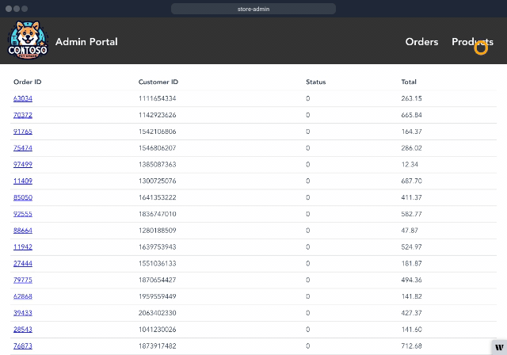

Module 3 - Let's explore Calico Cloud
==============

In this module we will return to Calico Cloud and take a look at our application and observe how each of the services are interacting.

We will also use Calico Cloud to troubleshoot why the Open AI service isn't working corectly.


# Enable L7 (http) logging

Just like L3/4 Calico Cloud logs, platform operators and development teams want visibility into L7 logs to see how applications are interacting with each other.
Calico Cloud flow logs only display which workloads are communicating with each other, not the specific request details.
Calico Cloud provides visibility into L7 traffic without the need for a service mesh.

L7 logs are also key for detecting anomalous behaviors like attempts to access applications, restricted URLs, and scans for particular URLs.

1. Configure Felix for log data collection
   Enable the Policy Sync API in Felix.

```bash
   kubectl patch felixconfiguration default --type='merge' -p '{"spec":{"policySyncPathPrefix":"/var/run/nodeagent"}}'
```

2. Enable L7 log collection

```bash
kubectl apply -f -<<EOF
apiVersion: operator.tigera.io/v1
kind: ApplicationLayer
metadata:
  name: tigera-secure
spec:
  logCollection:
    collectLogs: Enabled
    logIntervalSeconds: 5
    logRequestsPerInterval: -1
EOF
```

3. Annotate all services in the `pets` namespace for L7 logging

```bash
   kubectl annotate svc --all -n pets projectcalico.org/l7-logging=true
```

4. *[Optional]* restart the pods in `pets` if you want to see l7 logs right away.    

    ```bash
    kubectl delete pods --all -n pets
    ``` 

5. In store admin, repeat the steps from the previous module to generate some traffic.
   Select the products tab, then select Add Products.

   Fill in the name, price, and keywords, then generate a product description by selecting Ask OpenAI > Save product.

   

# Visualize the application in Calico Cloud

1. Open up Calico Cloud to visualize the application

   In the left-hand menu,  navigate to `Service Graph` > `Default`.
   You should see all of the namespaces within your cluster.
   Expand the view on `pets` by double-clicking on the icon.

   

   The connections in service graph should match the reference architecture diagram:
   

2. You can also investigate the cluster using Flow Visualizer.

   In the left-hand menu, click Service Graph, and under other, click Flow Visualizations.

   Flow visualizer offers a 360' volumetric view of traffic within a cluster.
   Click around to explore and filter different flows, and investigate the associated metadata.

   

---

[:arrow_right: Introduction to troubleshooting with Calico Cloud](/modules/module-4-troubleshooting.md)   <br>

[:arrow_left: Deploy the store front application](/modules/module-2-deploy-application.md) <br>
[:leftwards_arrow_with_hook: Back to Main](/README.md)  
