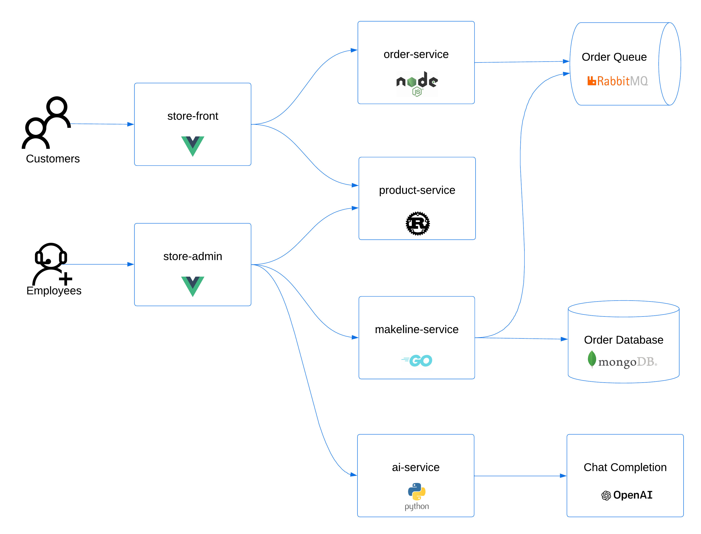
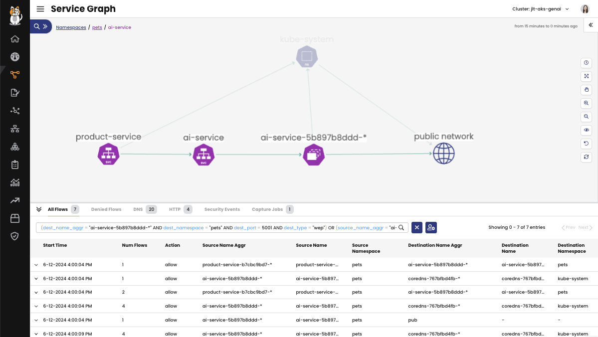
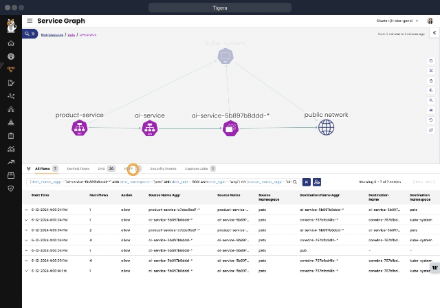
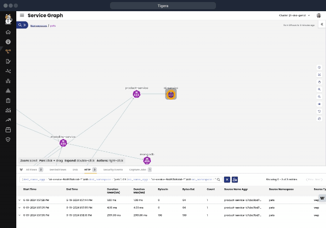
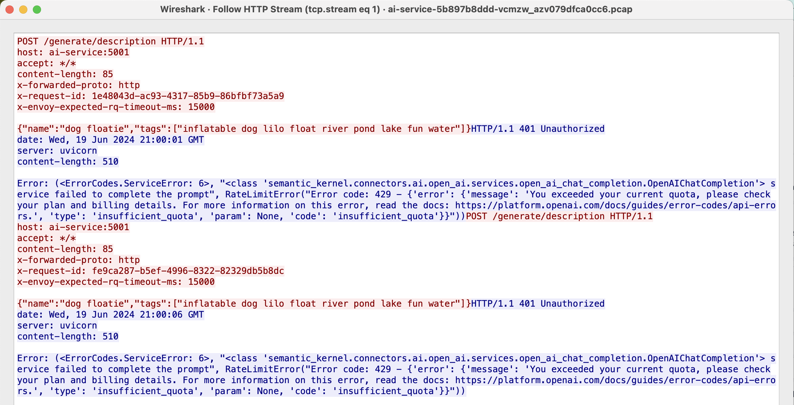
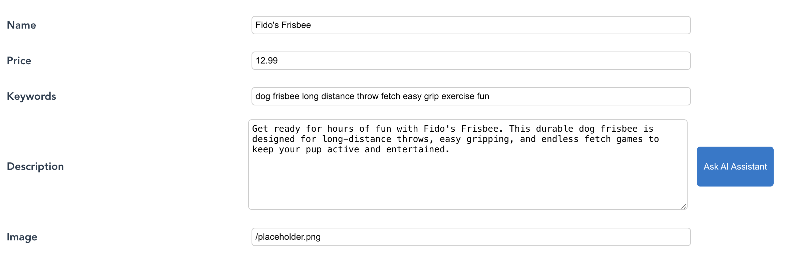
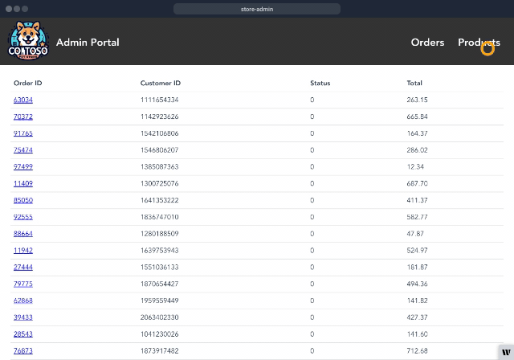

Module 4 - Let's use Calico Cloud for troubleshooting
==============

In this module we will use Calico Cloud and take a look at what is available for troubleshooting.

We will use Calico Cloud to troubleshoot why the Open AI service isn't working corectly.


# View L7 (http) logs

In the previous module we enable L7 logging.

These logs can be viewed in service graph.

1. Open up Calico Cloud to visualize the application

   In the left-hand menu,  navigate to `Service Graph` > `Default`.
   You should see all of the namespaces within yuor cluster.
   Expand the view on `pets` by double-clicking on the icon.

   

   The connections in service graph should match the reference architecture diagram:
   

2. Explore the ai-service

   Double-click on the ai-esrvice icon to see all flows to and from the ai-service.

   

   This doesn't tell us much, as all flow lines are green (allowed).

   Click on the HTTP tab in the bottom panel.

   

   It looks like the Open AI service is returning a `401`.

3. Confirm the 401 response with pod logs

   Get the pod name for the ai-service:
```bash
   kubectl get pods -n pets
```

   Look at the ai-service logs:

```bash
kubectl logs ai-service-5b897b8ddd-fnpq5 -n pets
INFO:     Started server process [1]
INFO:     Waiting for application startup.
INFO:     Application startup complete.
INFO:     Uvicorn running on http://0.0.0.0:5001 (Press CTRL+C to quit)
Using OpenAI and setting up Semantic Kernel
Generative AI capabilities:  description
INFO:     10.224.0.118:39693 - "GET /health HTTP/1.1" 200 OK
Calling OpenAI
INFO:     10.224.0.118:39693 - "POST /generate/description HTTP/1.1" 401 Unauthorized
Calling OpenAI
INFO:     10.224.0.118:45673 - "POST /generate/description HTTP/1.1" 401 Unauthorized
Calling OpenAI
INFO:     10.224.0.118:48509 - "POST /generate/description HTTP/1.1" 401 Unauthorized
INFO:     10.224.0.62:54133 - "GET / HTTP/1.1" 404 Not Found
```

# Start a packet capture

Because the flow logs and pod logs only show that we're getting a 401, and not why, we will use a packet capture to try and get more information.

1. Right-click on the ai-service in service graph to initiate a packet capture.

   

2. While the packet capture is running, repeat the steps to add products to the store and generate a product description.

3. Inspect the capture.
   
   Once the packet capture is complete, from the right hand side in the packet capture tab, click to download it.

   Open the packet capture in a tool like Wireshark.

   Look for an `HTTP/1.1 401 Unauthorized` in the packet info.
   Right click on the capture > Follow > HTTP Stream.

   You should see a more informative error message from the OpenAI service:
   `RateLimitError("Error code: 429 - {'error': {'message': 'You exceeded your current quota, please check your plan and billing details. For more information on this error, read the docs: https://platform.openai.com/docs/guides/error-codes/api-errors.'`

   

# Fix the issue

To successfully use the OpenAI service, you need a paid plan.

[Start a paid plan](https://platform.openai.com/account/billing/overview) to use OpenAI API.

Once you have bought OpenAI credits, or set up billing, add the correct credentials to the `ai-service.yaml` file.

1. Open the file named ai-service.yaml in the manifests folder.

2. Set the environment variable ```USE_AZURE_OPENAI``` to "False".
   
3. Set the environment variable ```OPENAI_API_KEY``` by pasting in the [OpenAI key](https://platform.openai.com/account/api-keys) from a paid account.

4. Find your [OpenAI organization ID](https://platform.openai.com/account/org-settings), copy the value, and set the ```OPENAI_ORG_ID``` environment variable.

5. Deploy the AI service using your edited manifest.

```bash
   kubectl apply -f ai-service.yaml -n pets
```

6. To ensure all of the services are updated to use to corrected AI service, restart the deployments.
   
```bash
kubectl rollout restart deployment -n pets
```

7. Verify that the `ai-service` is working correctly.
   
   In store admin, select the products tab, then select Add Products.

   When the `ai-service` is running successfully, you should see the `Ask AI Assistant` button next to the description field.
   Fill in the name, price, and keywords, then generate a product description by selecting `Ask AI Assistant` > `Save Product`.

   For example:

   | Product  | Fido's Frisbee                                               |   |   |   |
   | Price    | 12.99                                                        |   |   |   |
   | Keywords | dog frisbee long distance throw fetch easy grip exercise fun |   |   |   |

   

   

---

[:arrow_right: Introduction to troubleshooting with Calico Cloud](/modules/module-4-troubleshooting.md)   <br>

[:arrow_left: Deploy the store front application](/modules/module-2-deploy-application.md) <br>
[:leftwards_arrow_with_hook: Back to Main](/README.md)  
