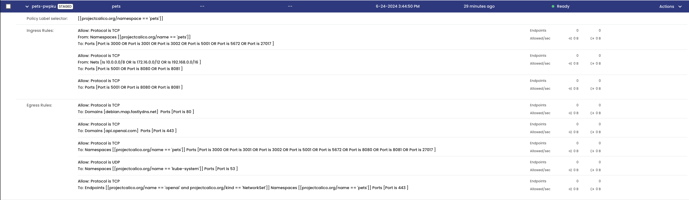
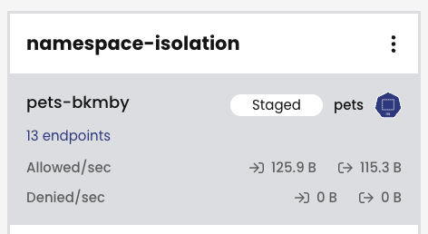
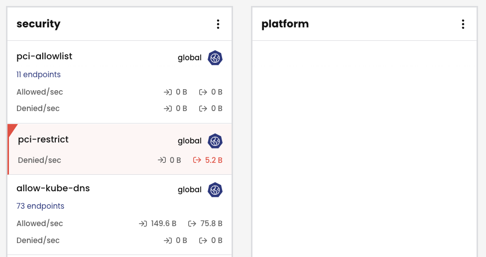

Module 5 - Let's use network policy to secure our store and gen ai workflows
==============

In this module we will use Calico's network security features to secure and protect our store and gen ai workflows.

#### You will learn the following:

- How to use declarative and label-based Calico Network Policies to enforce zone-based controls and security requirements
- How to use Policy Tiers as way to enforce higher precedent security and compliance policies that cannot be circumvented by application and development teams
- How to use Policy Recommendations to speed up cluster security

# Network Policies

Calico network policies are:

- Declarative - define security intentions in YAML files (or by creating a policy from the Calico Cloud or Calico Enterprise Manager UI)
- Label-based - network policies apply to endpoints based on workload identity using label selectors. These can be combined into larger expressions using multiple operators and parentheses.
- Dynamic - network policies are tightly coupled with workloads based on their identity, not ever-changing IP addresses

Let’s quickly take a look at the pods (and their labels) running in the `pets` namespace:

```bash
kubectl get pods -n pets --show-labels
```

`NAME                            LABELS
ai-service-7745f9864d-t4mm2         app=ai-service,pod-template-hash=7745f9864d
makeline-service-6fc9df6887-kvcxq   app=makeline-service,pod-template-hash=6fc9df6887
mongodb-0                           app=mongodb,apps.kubernetes.io/pod-index=0,controller-revision-hash=mongodb-67b9cc44bc,statefulset.kubernetes.io/pod-name=mongodb-0
order-service-96cc4c68b-k7j92       app=order-service,pod-template-hash=96cc4c68b
product-service-b7cbc9bd7-jp4h8     app=product-service,pod-template-hash=b7cbc9bd7
rabbitmq-0                          app=rabbitmq,apps.kubernetes.io/pod-index=0,controller-revision-hash=rabbitmq-76886c5866,statefulset.kubernetes.io/pod-name=rabbitmq-0
store-admin-d79444675-mv499         app=store-admin,pod-template-hash=d79444675
store-front-7f6c9646fc-bltzh        app=store-front,pod-template-hash=7f6c9646fc
virtual-customer-6cf9db7795-c2ms8   app=virtual-customer,pod-template-hash=6cf9db7795
virtual-worker-7c67d9b7f9-j7k97     app=virtual-worker,pod-template-hash=7c67d9b7f9
`

# Using the Policy Board

The Policy Board can provide a useful way to understand how policies are being evaluated across policy tiers on network flows in the cluster. 

- Login to the Calico Cloud UI and select Policies from the left navigation menu. Here you will see the Policy Board with all of the network policies defined within the cluster and how they map to policy tiers.
For now, this will be fairly empty.

## Policy Tiers

Calico Enterprise makes it easy to define the “guard rails” for your Kubernetes platform through the use of Policy Tiers.
Policy Tiers allow platform engineering and security teams to enforce network policies that take precedence over those defined for specific applications like our storefront.

Tiers are evaluated from left to right, and network policies within tiers are evaluated from top to bottom.
This effectively means that a network policy in the Security tier (Fig. 2) needs to evaluate and pass traffic before any policy below it or to the right can see that same traffic.
Tiers are tied to RBAC and provide a powerful way to implement security and platform controls for your entire cluster without having to involve application teams.
We will create a few policies in the `platform` and `security` tiers that provide some examples of some common use cases - compliance and egress access.
Policies specific to an application would typically go in the `default` tier.

# Policy Board Setup

Apply the policy-init.yaml in the manifest folder.

```bash
kubectl apply -f /manifests/policy-init.yaml
```

This create a few security policies, and the security and platform tiers.
You can explore these on the Policies Board.

# Calico Policy Recommendations for Namespace Isolation

Namespace isolation helps to implement a zero-trust and least-privileged security model, where only required communication between namespaces is authorized and everything else is blocked.
This helps mitigate the risk of lateral movement within a cluster in the event of an attack.

With Calico Cloud you can use policy recommendations to automatically isolate namespaces with network policy.

In the beginning of the workshop we enabled policy recommendations, but you can also do this through the UI on the Policy Recommendations page.

Policy recommendations are based on flow logs.

Recommended policies are continuously updated until you `Add to policy board` or `Dismiss policy` using the Actions menu.

Policy recommendations are created as staged network policies so you can safely observe the traffic before enforcing them.

Traffic originating from the recommended policy's namespace is used to generate egress rules, and traffic destined for the namespace is used to define ingress rules.

Navigate to `Policies` > `Policy Recommendations` in the Calico UI.
Based on all of the application activity so far you should see a policy recommendation for the pets namespace:



Click on `Actions` and `Add to policy board`.



# Calico Policy for PCI Compliance

The storefront demo application (if it were real) would be taking online payments, which means the store needs to be compliant with the PCI DSS (Payment Card Industry Data Security Standard).

One of the requirements of PCI DSS is to *"Install and maintain a firewall configuration to protect cardholder data"*.

This requirement is not written explicitly for containerized deployments, so a cautious, security-focused interpretation would be to use network policies to isolate the perimeter of the application that is handling cardholder data.

This will be done using identity-aware network policies.
To create a so-called firewall around our application, all pods that belong to our application need a common label.

1. Run this command, which adds a PCI label to every pod in the hipstershop namespace:

```bash
kubectl label pods --all -n pets pci=true
```

2. Verify the label has been applied.

```bash
kubectl get pods -n pets --show-labels
```

`NAME                                LABELS
ai-service-7745f9864d-t4mm2         app=ai-service,pci=true,pod-template-hash=7745f9864d
makeline-service-6fc9df6887-kvcxq   app=makeline-service,pci=true,pod-template-hash=6fc9df6887
mongodb-0                           app=mongodb,apps.kubernetes.io/pod-index=0,controller-revision-hash=mongodb-67b9cc44bc,pci=true,statefulset.kubernetes.io/pod-name=mongodb-0
order-service-96cc4c68b-k7j92       app=order-service,pci=true,pod-template-hash=96cc4c68b
product-service-b7cbc9bd7-jp4h8     app=product-service,pci=true,pod-template-hash=b7cbc9bd7
rabbitmq-0                          app=rabbitmq,apps.kubernetes.io/pod-index=0,controller-revision-hash=rabbitmq-76886c5866,pci=true,statefulset.kubernetes.io/pod-name=rabbitmq-0
store-admin-d79444675-mv499         app=store-admin,pci=true,pod-template-hash=d79444675
store-front-7f6c9646fc-bltzh        app=store-front,pci=true,pod-template-hash=7f6c9646fc
virtual-customer-6cf9db7795-c2ms8   app=virtual-customer,pci=true,pod-template-hash=6cf9db7795
virtual-worker-7c67d9b7f9-j7k97     app=virtual-worker,pci=true,pod-template-hash=7c67d9b7f9`

3. Create the first of two network policies.
   This policy will allow traffic to the store-front and store-admin of the application over port 80. It will also ensure any communication with kube-dns is allowed.

``` bash
kubectl apply -f -<<EOF
apiVersion: projectcalico.org/v3
kind: GlobalNetworkPolicy
metadata:
  name: security.pci-allowlist
spec:
  tier: security
  order: 0
  selector: pci == "true"
  namespaceSelector: ""
  serviceAccountSelector: ""
  ingress:
    - action: Allow
      protocol: TCP
      source: {}
      destination:
        selector: app == store-admin || app == store-front
        ports:
          - "80"
  egress:
    - action: Allow
      protocol: UDP
      source: {}
      destination:
        selector: k8s-app == "kube-dns"
        ports:
          - "53"
    - action: Allow
      protocol: TCP
      source: {}
      destination:
        selector: k8s-app == "kube-dns"
        ports:
          - "53"
  doNotTrack: false
  applyOnForward: false
  preDNAT: false
  types:
    - Ingress
    - Egress
EOF
```

4. Create the second policy that allows traffic between pods labelled with `pci=true`.
   
```bash
kubectl apply -f -<<EOF
apiVersion: projectcalico.org/v3
kind: GlobalNetworkPolicy
metadata:
  name: security.pci-restrict
spec:
  tier: security
  order: 75
  selector: pci == "true"
  namespaceSelector: ""
  serviceAccountSelector: ""
  ingress:
    - action: Allow
      source:
        selector: pci == "true"
      destination: {}
    - action: Pass
      source:
        selector: pci != "true"
      destination: {}
  egress:
    - action: Allow
      source: {}
      destination:
        selector: pci == "true"
    - action: Pass
      source: {}
      destination:
        selector: pci != "true"
  doNotTrack: false
  applyOnForward: false
  preDNAT: false
  types:
    - Ingress
    - Egress
EOF
```

5. Check the Policy Board.
   The policy board in Calico UI should show the newly created policies and tiers.
   From the left-hand menu click `Policies` > `Policies`.

   You should something like this:

   


6. Deploy pods to test and verify communication
    
   We will use a pod named `multitool` to test this.
   This pod is not part of the pets application; it's purpose is for testing policies.
   We will install two versions of this pod, one with the `pci=true` label, and one without.

```bash
kubectl apply -f -<<EOF
apiVersion: v1
kind: Pod
metadata:
  name: multitool-pci
  namespace: pets
  labels:
    app: multitool
    pci: "true"
spec:
  containers:
  - name: multitool
    image: wbitt/network-multitool
    resources: {}
---
apiVersion: v1
kind: Pod
metadata:
  name: multitool
  namespace: pets
  labels:
    app: multitool
spec:
  containers:
  - name: multitool
    image: wbitt/network-multitool
    resources: {}
EOF
```

7. Test connectivity from a pod *with* the label 'pci=true'

   The multitool pod has curl and netcat installed to test communications.

   Try connecting to the `product-service` from the `multitool-pci` pod:

   ```bash
   kubectl -n pets exec -t multitool-pci -- sh -c 'nc -zvw 3 product-service.pets 3002'
   ```

   The test should work, because both source (`multitool-pci`) and destination (`product-service`) have the `pci=true` label:
   `product-service.pets (10.0.28.173:3002) open`

   ```bash
   kubectl -n pets exec -t multitool-pci -- sh -c 'curl -I store-front.pets 2>/dev/null | grep -i http'
   ```
   The test should work, because both source (`multitool-pci`) and destination (```store-front```) have the `pci=true` label.
   `HTTP/1.1 200 OK`

   Additionally, we allowed ingress traffic to the `store-admin` and `store-front` on port 80.

8. Test connectivity from a pod *without* the label 'pci=true'

   The multitool pod has curl and netcat installed to test communications.

   Try connecting to the `product-service` from the `multitool` pod:

   ```bash
   kubectl -n pets exec -t multitool -- sh -c 'nc -zvw 3 product-service.pets 3002'
   ```

   The test should not work, because the source (`multitool`) does not have the `pci=true` label:
   `nc: product-service.pets (10.0.28.173:3002): Operation timed out`
   `command terminated with exit code 1`

   ```bash
   kubectl -n pets exec -t multitool -- sh -c 'curl -I store-front.pets 2>/dev/null | grep -i http'
   ```
   The test should work, because we allowed ingress traffic to the `store-admin` and `store-front` on port 80.

   Currently, this test does not work.
   Using Service Graph and the Flow Logs, we can see that the `pci-restrict` policy is blocking traffic:
   `policies      0|security|security.pci-restrict|deny|-1`

